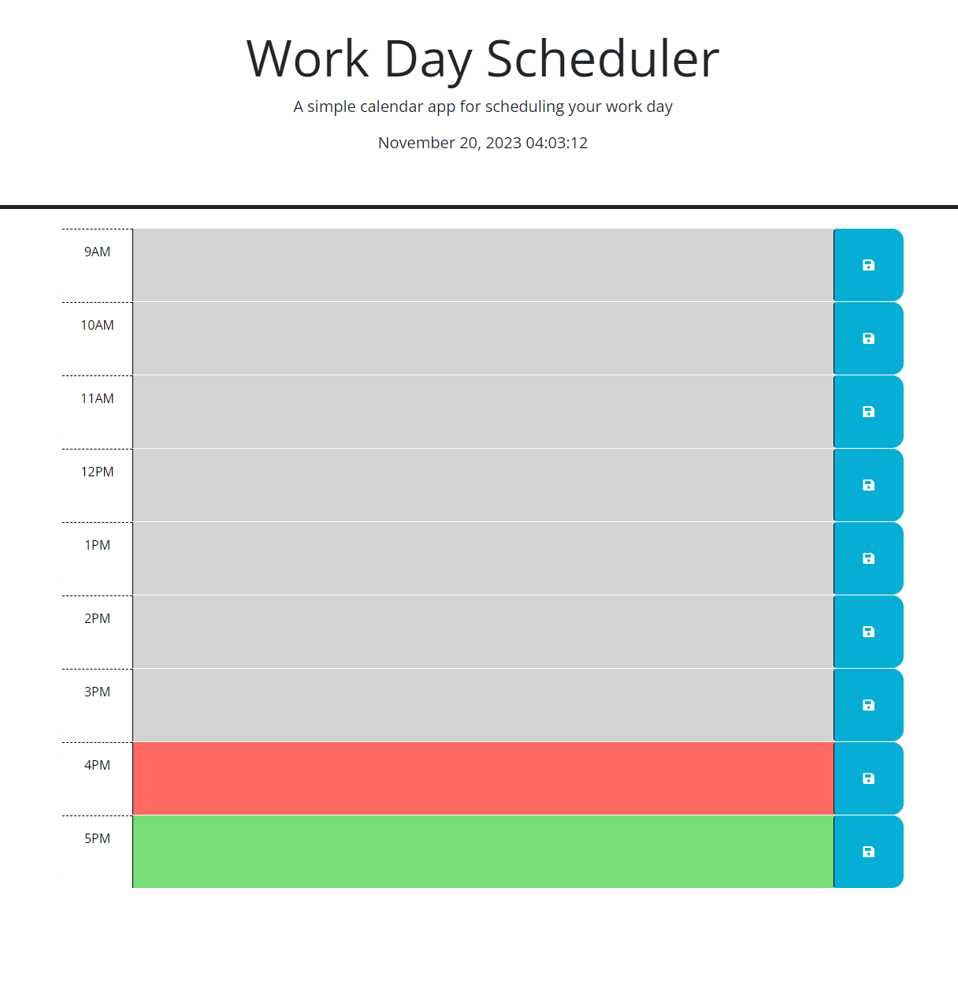

# Work Day Scheduler
This is a simple single page application to organize your work day. Simply type in the time block you scheduled reminder and click the save button to save it to your local storage on your browser. Past time blocks are grey, present time blocks are red, and future time blocks are green. 

## Table of Contents

- [Preview](#preview)
- [License](#license)
- [Contact](#contact)
  
## Preview

Visit the live site [here!](https://andruegage.github.io/webapi-timed-quiz/)

## License

This project is licensed under the [MIT License](https://choosealicense.com/licenses/mit/). You are free to use, modify, and distribute this project as long as you provide proper attribution and include the original license in your distribution.

## Contact

You can contact me via [trainer.andrue@gmail.com](mailto:trainer.andrue@gmail.com)
Check out my [github](https://github.com/AndrueGage) for more projects. 